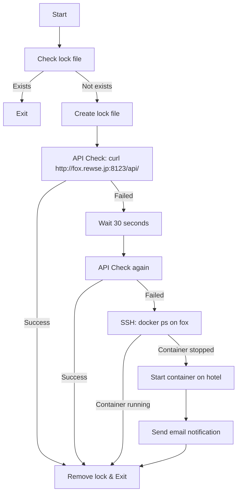
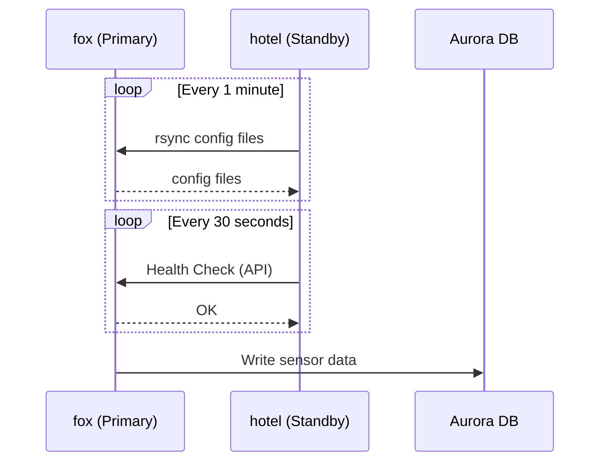
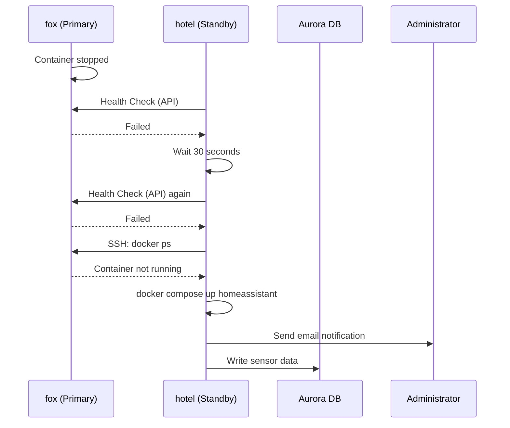
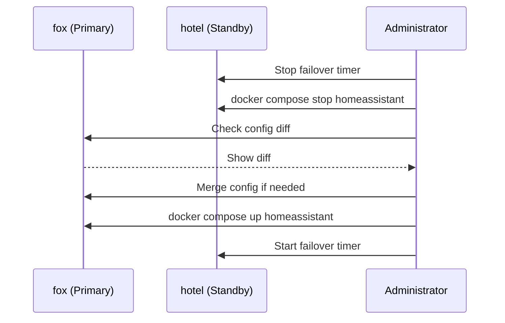

# Home Assistant High Availability - 設計ドキュメント

## アーキテクチャ概要

本システムは、fox（プライマリ）とhotel（スタンバイ）の2ノード構成によるアクティブ/スタンバイ型のHA構成を実現する。

```mermaid
graph TB
    subgraph "fox (Primary)"
        A[Home Assistant Container]
        B[/srv/homeassistant/config]
        C[rsync daemon]
    end
    
    subgraph "hotel (Standby)"
        D[Home Assistant Container<br/>Stopped]
        E[/srv/homeassistant/config]
        F[Failover Monitor]
    end
    
    subgraph "External"
        G[(Aurora PostgreSQL)]
        H[Mail Server]
    end
    
    B -->|rsync every 1min| E
    F -->|1. Health Check API| A
    F -->|2. Check Container Status via SSH| A
    F -->|3. Start if failed| D
    A --> G
    D -.-> G
    F -->|Notification| H
```

## コンポーネント設計

### 1. rsync daemon（fox側）

**目的:** foxの設定ファイルをhotelから取得可能にする

**実装:**
- `/etc/rsyncd.conf` でモジュール `homeassistant-config` を定義
- `/srv/homeassistant/config` を公開
- systemdで `rsync.service` を起動
- ポート873（rsync標準ポート）をリッスン

**設定例:**
```ini
[homeassistant-config]
path = /srv/homeassistant/config
read only = yes
list = yes
uid = root
gid = root
hosts allow = 192.168.0.0/24
```

### 2. rsync同期スクリプト（hotel側）

**目的:** foxの設定ファイルを定期的に同期

**実装:**
- `/usr/local/bin/homeassistant-sync.sh`
- rsyncコマンドで `rsync://fox.rewse.jp/homeassistant-config` から同期
- systemd timerで1分ごとに実行

**同期オプション:**
- `-a`: アーカイブモード（パーミッション、タイムスタンプ保持）
- `--delete`: 削除されたファイルも同期
- `--exclude`: 一時ファイルを除外

### 3. ヘルスチェックスクリプト（hotel側）

**目的:** foxのHome Assistantを監視し、異常時にフェイルオーバー

**実装:**
- `/usr/local/bin/homeassistant-failover.sh`
- systemd timerで30秒ごとに実行

**チェックフロー:**


**ロックファイル:**
- `/var/run/homeassistant-failover.lock`
- 二重実行を防止
- スクリプト終了時に削除

### 4. Docker Compose設定（hotel側）

**目的:** hotelでもHome Assistantコンテナを起動可能にする

**実装:**
- `/etc/compose.yml` にhomeassistantセクションを追加
- foxと同じ設定を使用
- 通常は起動しない（`state: present`）

**注意点:**
- デバイスマッピング（`/dev/ttyUSB0`）はhotelに存在しない可能性がある
- ネットワークモード `host` を使用するため、ポート競合はない

### 5. メール通知

**目的:** フェイルオーバー発生時に管理者に通知

**実装:**
- 既存のpostfix設定を利用
- `mail` コマンドでメール送信

**通知内容:**
- 件名: `[ALERT] Home Assistant Failover: fox -> hotel`
- 本文:
  - フェイルオーバー発生時刻
  - 理由（APIチェック失敗、コンテナ停止）
  - 現在の状態（hotelで起動完了）

## データフロー

### 通常運用時



### フェイルオーバー時



### 手動復旧時



## ファイル構成

### Ansible Role: homeassistant-ha

```
roles/homeassistant-ha/
├── tasks/
│   └── main.yml              # メインタスク（fox/hotel分岐）
├── files/
│   ├── rsyncd.conf           # rsync daemon設定（fox用）
│   ├── homeassistant-sync.sh # 同期スクリプト（hotel用）
│   ├── homeassistant-failover.sh # フェイルオーバースクリプト（hotel用）
│   ├── homeassistant-sync.service
│   ├── homeassistant-sync.timer
│   ├── homeassistant-failover.service
│   └── homeassistant-failover.timer
└── handlers/
    └── main.yml              # ハンドラー定義
```

## セキュリティ考慮事項

### rsync daemon

- **認証:** なし（ローカルネットワーク内のみ）
- **アクセス制御:** `hosts allow = 192.168.0.0/24`
- **読み取り専用:** `read only = yes`

### SSH接続

- **認証:** 公開鍵認証
- **用途:** コンテナ状態確認のみ
- **権限:** ubuntu ユーザー（sudo可能）

### メール通知

- **プロトコル:** SMTP（既存のpostfix設定）
- **認証:** 既存の設定を利用

## パフォーマンス考慮事項

### rsync同期

- **間隔:** 1分
- **データ量:** 数MB〜数十MB（設定ファイルのみ）
- **ネットワーク負荷:** 低（差分のみ転送）

### ヘルスチェック

- **間隔:** 30秒
- **タイムアウト:** 5秒
- **リトライ:** 1回（30秒待機後）

### フェイルオーバー時間

- **検知時間:** 最大60秒（30秒×2回）
- **起動時間:** 約30秒〜1分
- **合計RTO:** 約2分以内

## 制限事項

### 設定ファイルの競合

- フェイルオーバー中にhotelで設定変更すると、fox復旧時に上書きされる
- 運用ルールで対応（フェイルオーバー中は設定変更しない）

### デバイスマッピング

- hotelに `/dev/ttyUSB0` が存在しない場合、一部の統合が動作しない可能性がある
- Zigbee/Z-Waveデバイスは影響を受ける可能性がある

### ネットワーク分断

- fox-hotel間のネットワークが切断された場合、スプリットブレインが発生する可能性がある
- ただし、ネットワーク分断時はHome Assistantがサービス提供できないため、許容する

## 今後の拡張性

### 自動フェイルバック

- foxの復旧を検知して自動的に切り戻す機能
- 設定ファイルの自動マージ機能

### 双方向同期

- hotelでの設定変更をfoxに反映する機能
- Syncthing等の双方向同期ツールの導入

### 3ノード構成

- 第3のノードを追加してquorumを確保
- スプリットブレイン対策の強化
