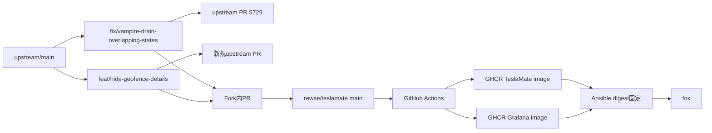

# TeslaMateジオフェンス位置詳細非表示設計

## 目的

GeoFenceごとに位置詳細の表示可否を設定し、対象GeoFence内の住所と経路点を一部のGrafanaパネルから除外する。GeoFence名と集計情報は表示を維持する。位置データはデータベースに保存し続け、設定を解除すると過去の住所と経路を再表示できるようにする。

現在はAnsibleが公式Grafanaイメージからダッシュボードを抽出し、固定したGeoFence名を使ってTrip、Visited、Drive DetailsのSQLへフィルターを追加している。本設計ではTeslaMate本体とGrafanaを`rewse/teslamate` Forkで直接変更し、実行時パッチを廃止する。Vampire Drain修正は既存のupstream PR [teslamate-org/teslamate#5729](https://github.com/teslamate-org/teslamate/pull/5729)の変更をForkへ統合する。

## 表示範囲

`hide_details`を有効にしたGeoFenceでは、次の情報だけを非表示にする。

- LocationsダッシュボードのAddressesパネルにあるGeoFence内部の住所
- Tripダッシュボードの経路レイヤーにあるGeoFence内部の位置点
- Visitedダッシュボードの経路レイヤーにあるGeoFence内部の位置点
- Drive Detailsダッシュボードの経路レイヤーにあるGeoFence内部の位置点

次の情報は表示を維持する。

- Locationsの# of Addresses、Cities、States、Last visited、Geo-fences
- GeoFence名
- Tripやほかのダッシュボードにあるドライブ、充電、距離、時間などの情報
- 上記4クエリ以外が表示する住所や位置情報

経路はGeoFence内部の位置点を除外する。入口直前と出口直後の点をGrafanaが直線で結ぶ可能性は許容し、経路のセグメント分割は行わない。

## UI

GeoFenceの作成・編集フォームでNameとCostの間に次の行を追加する。

- 行ラベル: `Visibility`、日本語は「表示」
- checkbox: `Hide location details`、日本語は「位置情報の詳細を非表示」
- control: 既存Settings画面と同じ`switch is-rounded is-success`
- 補足文: `Hide addresses in Locations and route points in Trip, Visited and Drive Details. The underlying location data remains stored.`

補足文は対象パネルとデータ保持を常時表示し、完全な匿名化や記録停止との誤解を避ける。`Hidden`はGeoFence自体が消えるように読めるため使わない。`Privacy zone`は保存停止や全画面での秘匿を連想させるため使わない。

実画面では幅1123pxのviewportでフォームが960px、左ラベル列が200px、列間余白が24px、field bodyが736pxだった。実際のフォントにおける`Hide location details`の幅は157.1px、日本語候補の幅は176pxである。768px以下ではラベルとfield bodyが縦に並び、375px幅でも横方向にはみ出さない。既存のラベル列とレスポンシブ規則を維持し、専用CSSは追加しない。

## データモデル

新しいmigrationで`geofences`へ次のカラムを追加する。

```elixir
add :hide_details, :boolean, null: false, default: false
```

`TeslaMate.Locations.GeoFence`に`field :hide_details, :boolean, default: false`を追加し、changesetのcast対象に含める。`hide_details`は12文字で、同じschemaの`billing_type`、`session_fee`、`cost_per_unit`と同程度の長さである。GeoFence文脈では`location`が重複するため、カラム名を`hide_location_details`にはしない。

既存GeoFenceはmigration後も`false`となり、表示は変わらない。`hide_details`だけを変更した場合は位置や料金が変わらないため、充電料金再計算モーダルを表示しない。

## 空間判定

Addressesには現在`geofence_id`がないため、住所の緯度・経度をGeoFenceの円へ含むか判定する。経路点も同じ判定を使う。対象クエリへ次の形の`NOT EXISTS`を追加する。

```sql
AND NOT EXISTS (
  SELECT 1
  FROM geofences g
  WHERE g.hide_details
    AND earth_box(
          ll_to_earth(g.latitude, g.longitude),
          g.radius
        ) @> ll_to_earth(source.latitude, source.longitude)
    AND earth_distance(
          ll_to_earth(g.latitude, g.longitude),
          ll_to_earth(source.latitude, source.longitude)
        ) < g.radius
)
```

`earth_box`で候補を絞り、`earth_distance`で円内を判定する。複数のGeoFenceが重なる場合は、いずれか1つで`hide_details = true`なら位置詳細を除外する。専用のDB関数やviewは追加しない。GeoFence件数が少なく、空間式には通常のboolean indexが使われないため、`hide_details`単独のindexも追加しない。

4つの対象クエリだけを変更する。Locationsの他パネルやTripのデータパネルにはフィルターを波及させない。設定変更後のGrafanaクエリから過去データを含めて結果が変わり、コンテナ再起動やイメージ再作成は発生しない。

## 構成と変更の流れ



上流PR用の2ブランチは`upstream/main`から独立して作る。Forkの`main`はrewse環境の統合・配備ブランチとし、直接pushせずFork内PRで変更を取り込む。新しい上流PRにVampire Drain修正やAnsible固有の変更を混ぜない。

Forkの既存GHCR workflowはTeslaMate本体とGrafanaを同じcommitからビルドする。`main`へのpushで生成されたイメージを検証し、Ansibleには可変タグだけでなくmanifest digestを含む参照を保存する。`main`タグが更新されても本番は自動更新しない。

2026年9月12日の確認時点で、`rewse/teslamate`のActions APIはworkflow 0件を返し、`rewse`のGHCRコンテナパッケージも0件だった。実装時にForkのGitHub Actionsを有効化する。最初のビルドで作成した本体・Grafana packageはpublicに設定し、foxからpull credentialなしで取得できることをAnsible変更前に確認する。packageをpublicにできない場合は配備を止め、pull認証の設計と1Password参照の追加について改めて承認を得る。

## Ansibleの最終状態

TeslaMate roleは検証済みのFork本体・Grafanaイメージをdigest付きで参照する。次の実行時パッチ資材を削除する。

- `roles/teslamate/files/patch_vampire_drain_dashboard.py`
- `roles/teslamate/files/patch_visited_dashboard.py`
- 対応するPython単体テスト
- `teslamate_grafana_excluded_geofence`
- 公式イメージからダッシュボードを抽出するタスクと一時コンテナ
- 4ダッシュボードを変換するタスク
- Trip、Visited、Drive Details、Vampire Drainのbind mount
- パッチ専用の`grafana-dashboards`ディレクトリ作成

ComposeテンプレートはForkイメージと既存の永続ボリュームだけを持つ。check modeはイメージをbuildまたはpullせず、予定するCompose差分を報告する。テンプレート契約テストはdigest付きGHCR参照とbind mount不在を確認する。

## 初回配備

初回は本体とGrafanaを分けて配備する。

1. ForkのTeslaMate本体イメージをdigest固定で配備し、起動時migrationを完了させる。
2. GeoFenceフォームでcheckboxの保存と再表示を確認する。この段階では既存のパッチ済みGrafanaを維持する。
3. ForkのGrafanaイメージをdigest固定で配備し、4つのbind mountとパッチ処理を撤去する。
4. 対象GeoFenceで`hide_details`を有効にし、4つの対象表示と維持対象の表示を確認する。
5. `hide_details`を解除して過去の住所と経路が戻ることを確認する。
6. Playbookを再実行し、変更が発生しないことを確認する。

この順序により、新しいGrafana SQLがmigration前のDBへ問い合わせる時間を作らない。

## 障害とロールバック

GHCRからイメージをpullできない場合はComposeを変更せず、現在のコンテナを維持する。未検証のタグや公式最新版へ自動でフォールバックしない。

TeslaMate本体が起動しない場合は直前の公式本体digestへ戻す。旧バージョンは追加された`hide_details`カラムを参照しないため、migrationをdownせずカラムを残す。GrafanaでSQLエラーや性能退行が発生した場合は、直前の公式Grafana digestとbind mount構成へ戻す。データベース内の住所と位置点はどのロールバックでも削除しない。

表示だけを戻す場合はcheckboxを解除する。クエリ自体に問題がある場合はGrafanaイメージを戻し、設定値は保持する。

## テスト

実装はテストを先に追加する。

### TeslaMate本体

- migration後の既存GeoFenceと新規GeoFenceで`hide_details = false`になることを確認する。
- changesetが`true`と`false`を保存できることを確認する。
- LiveViewでラベル、switch、補足文、checked状態、保存後の再表示を確認する。
- `hide_details`だけの変更で充電料金再計算モーダルが開かないことを確認する。
- `mix gettext.extract --merge`で翻訳メッセージを更新する。
- `treefmt`または`nix run .#lint`と`mix ci`を実行する。

### Grafana SQL

- JSON解析テストで4対象クエリにフィルターが1回ずつあり、対象外クエリに追加されていないことを確認する。
- 合成データで円内、円外、境界、複数、重複GeoFenceを検証する。
- `hide_details = false`では従来結果と一致し、`true`では内部の住所・位置点だけが消えることを確認する。
- 解除後に同じ履歴が戻り、Last visitedとGeo-fencesのGeoFence名が残ることを確認する。
- 全ダッシュボードJSONの構文と既存`TeslaMate.Grafana.DashboardQueriesTest`を検証する。

TeslaMate開発ガイドに従い、4クエリを修正前後で`EXPLAIN (ANALYZE, BUFFERS)`比較する。時刻・車両条件を越える無制限な`positions`走査を追加しない。ウォームキャッシュで複数回測定し、実行時間中央値が1.5倍を超え、かつ100ms以上増えた場合は上流PR前にクエリを見直す。

### UIと本番

- 1123px幅で既存ラベル列との整列を確認する。
- 375px幅で縦積み、横スクロール、文字切れを確認する。
- keyboard操作とlabel関連付けを確認する。
- 本番相当データでAddressesと3経路だけが変わり、維持対象が変わらないことを確認する。
- TeslaMateとGrafanaのログにLiveViewエラーやSQLエラーがないことを確認する。

実データを含むスクリーンショット、住所、座標はリポジトリや上流PRへ保存しない。PRに画像が必要な場合は合成データで撮影する。

### Ansibleとイメージ

- Forkの`main`から本体とGrafanaの両イメージを生成する。
- fox向け`linux/amd64` manifestとdigestを確認する。
- Composeテンプレートがdigest付きGHCR参照を持ち、4つのbind mountを持たないことを確認する。
- Pythonパッチ、固定GeoFence変数、抽出・変換タスクが残っていないことを確認する。
- テンプレート契約テスト、syntax check、`ansible-lint`、本番check modeを実行する。
- 本適用後の2回目のPlaybook実行が変更なしになることを確認する。

## 上流PR

新しい上流PRにはmigration、GeoFence schemaとLiveView、翻訳メッセージ、テスト、4ダッシュボードだけを含める。Ansible、rewse用イメージ参照、実データは含めない。外部ForkのPRには公式のPR用イメージが生成されないため、ローカルテストとrewse GHCRイメージによる検証結果を記載する。

TeslaMate開発ガイドに従い、必要なFLA 2.0対応を行い、PR本文末尾にAI支援を次の形式で開示する。

```markdown
---

🤖 Assisted by GPT-5.6-sol (OpenAI) via Kiro CLI (planning, implementation, tests, and PR description).
```

Vampire Drain修正が公式リリースへ入った後は、Forkの重複commitを外してmainを更新する。GeoFence機能も公式リリースへ入った場合は、公式イメージへ戻す前に同じ表示・復元テストを行う。

## 対象外

- データベースへの位置情報保存を停止する機能
- 既存位置情報の削除または匿名化
- GeoFence名の非表示
- 4対象クエリ以外の住所・位置表示の変更
- 経路の入口と出口を分断する処理
- GeoFenceごとの車両別設定

## 完了条件

- `hide_details`の保存、解除、既定値、翻訳、レスポンシブUIのテストが通る。
- 4対象クエリだけがGeoFence内部の住所・位置点を除外する。
- 性能比較が基準を満たす。
- Forkの本体・Grafanaイメージを同じmain commitから生成し、Ansibleが検証済みdigestを参照する。
- 本番で非表示、維持対象、解除後の復元、ログ、Playbook冪等性を確認する。
- Ansibleから4ダッシュボードの実行時パッチを撤去する。
- 新しい機能を独立した上流PRとして提出する。
