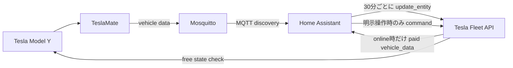

# TeslaMate Home Assistant discovery設計

## 背景

Home AssistantにはTesla Fleet統合が登録されているが、dashboard、automation、scriptからTesla Fleet entityを参照していない。TeslaMateは稼働中でMosquittoへ車両データをpublishしているものの、Home Assistant MQTT discoveryは無効である。

Tesla Fleet統合の標準pollingは10分間隔である。実装は無料の車両状態APIでonline状態を確認し、onlineの場合だけ有料のVehicle Data APIを呼ぶ。Teslaの現行単価はVehicle Data 500回/$1、個人利用向け無料クレジットは月$10である。

## 目標

- TeslaMateのHome Assistant MQTT discoveryを有効にし、読み取り用entityを自動登録する。
- Tesla Fleet統合の標準pollingを停止し、車両操作用entityを残す。
- Tesla Fleetデータを30分間隔で手動更新する。
- 車両を更新のためにwakeしない。
- Tesla Fleet APIの月額利用を無料クレジット内に収める。
- 設定をテストし、Ansibleで再現できる部分はAnsible管理にする。

## 非目標

- TeslaMate entityを既存のdashboardやautomationへ組み込まない。
- Tesla Fleet統合や操作用entityを削除しない。
- TeslaMateとTesla Fleetのentity IDを統一しない。
- Fleet Telemetry serverを追加しない。

## 構成



TeslaMateは`MQTT_HOME_ASSISTANT_DISCOVERY=true`でdiscovery payloadをpublishする。`MQTT_HOME_ASSISTANT_DISCOVERY_URL`には`https://teslamate.rewse.jp`を設定する。discovery prefixはHome AssistantとTeslaMate双方の既定値`homeassistant`を使う。

Tesla Fleet config entryの`pref_disable_polling`を`true`にする。この値はHome Assistantのstorage設定なので、MCPから`config_entries/update` WebSocket commandを呼んで永続化する。秘密情報や`.storage`ファイルをAnsibleから直接編集しない。

Home AssistantにはTesla専用automationファイルを追加する。`time_pattern` triggerを30分間隔とし、同時刻の集中を避けるため0から59の固定秒を設定する。actionは`homeassistant.update_entity`を一度だけ呼び、対象を`tesla_fleet` coordinatorに属する`sensor.model_y_battery_level`とする。coordinatorが全車両データを共有するため、複数entityを同時に更新しない。

## API利用量

30分間隔を30日間、車両が常時onlineという最大条件で計算する。

```text
2 calls/hour * 24 hours/day * 30 days = 1,440 Vehicle Data calls/month
1,440 calls / 500 calls per dollar = $2.88/month
```

無料クレジット$10に対して$7.12をcommandや手動操作に残す。各定期更新は最初に無料の車両状態APIを呼ぶ。車両がofflineまたはasleepならVehicle Data APIを呼ばず、wake commandも送らないため、通常の有料呼び出しは最大条件より少ない。

## エラー処理

定期更新が認証エラー、rate limit、通信エラーで失敗してもwakeや即時再試行を行わない。Home Assistantのautomation traceとTesla Fleet integration logへ記録し、次の30分triggerで再試行する。TeslaMate discoveryはTeslaMate起動時に再publishされる。

## 実装範囲

- TeslaMate env templateへdiscovery変数を追加する。
- TeslaMate template契約テストへdiscovery設定の期待値を追加する。
- Home Assistantへ`automations-tesla.yaml`を追加する。
- Home Assistant roleのautomation copy listへ新規ファイルを追加する。
- MCPでTesla Fleet config entryの標準pollingを無効化する。

## 検証

- TeslaMate template契約テストがdiscovery変数とURLを確認する。
- 変更したYAMLをparserとyamllintで検証する。
- TeslaMate roleテスト、Ansible syntax check、ansible-lintを実行する。
- Home Assistantの`config_check`がvalidになることを確認する。
- 本番適用後、MQTT integration配下にTeslaMate deviceとentityが作成されることを確認する。
- Tesla Fleet config entryの`pref_disable_polling`が`true`であることを確認する。
- 定期更新automationが登録され、手動実行でエラーにならないことを確認する。
- 再適用時に不要な変更が出ないことを確認する。
