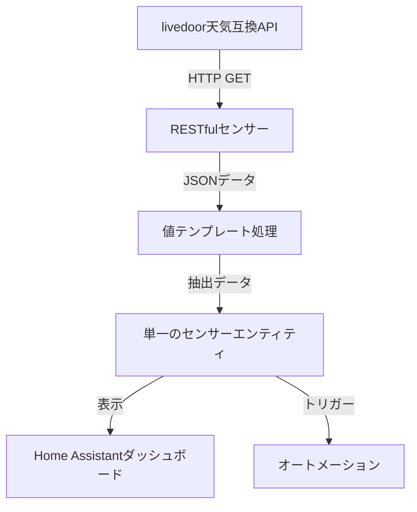

# 設計書

## 概要

このドキュメントでは、livedoor天気互換APIから天気予報データを取得するHome AssistantのRESTfulセンサーの設計について詳細に説明します。このセンサーは、APIからJSONデータを取得し、Home Assistantのエンティティとして利用可能にします。

## アーキテクチャ

このセンサーの実装は、Home Assistantの標準的なRESTfulセンサーコンポーネントを使用します。全体のアーキテクチャは以下のコンポーネントで構成されます：

1. **RESTfulセンサー**: Home Assistantの`rest`センサーコンポーネントを使用して、APIからデータを取得します。
2. **値テンプレート**: 取得したJSONデータから必要な情報を抽出するためのJinja2テンプレートを使用します。
3. **センサーエンティティ**: 抽出したデータを表示するための単一のセンサーエンティティを作成します。
4. **ダッシュボード表示**: 取得したデータをダッシュボードに表示するためのカードを設定します。



## 実装方法

このセンサーは、既存の `roles/homeassistant/files/sensors.yaml` ファイルに追記する形で実装します。これにより、新しいファイルを作成せずに、既存のHome Assistant設定に統合することができます。

## コンポーネントとインターフェース

### RESTfulセンサー

RESTfulセンサーは、設定されたURLからJSONデータを取得します。主な設定パラメータは以下の通りです：

- `resource`: APIエンドポイントのURL (https://weather.tsukumijima.net/api/forecast/city/130010)
- `method`: HTTPメソッド（GET）
- `scan_interval`: データ更新間隔（APIの負荷を考慮して設定）
- `timeout`: リクエストのタイムアウト時間
- `headers`: リクエストヘッダー（Accept: application/json）
- `json_attributes_path`: JSONデータのルートパス
- `json_attributes`: 取得する属性のリスト
- `value_template`: センサーの状態値を決定するテンプレート

### 値テンプレート

値テンプレートは、取得したJSONデータから必要な情報を抽出します。livedoor天気互換APIのレスポンス形式に基づいて、以下の情報を抽出します：

- 地域情報（area, prefecture, district, city）
- 予報情報（date, dateLabel, telop, detail.weather, detail.wind, detail.wave, temperature, image.url）
- 降水確率情報（chanceOfRain.T00_06, chanceOfRain.T06_12, chanceOfRain.T12_18, chanceOfRain.T18_24）
- 詳細情報（description.text, description.bodyText, description.headlineText）

### センサーエンティティ

単一のRESTfulセンサーエンティティを作成し、すべての天気情報をその属性として格納します。センサーの状態値（state）には現在の天気状態（telop）を使用します。

このアプローチにより、以下の利点があります：

1. **シンプルな構成**: 複数のセンサーを作成する代わりに、1つのセンサーのみを使用
2. **効率的なデータ取得**: APIからのデータ取得は1回のみ
3. **柔軟なデータアクセス**: 必要な情報はすべてセンサーの属性としてアクセス可能

センサーの属性には以下の情報が含まれます：

- **location**: 地域情報（area, prefecture, district, city）
- **forecasts**: 予報情報の配列（今日、明日、明後日）
- **description**: 天気の詳細説明
- **publicTime**: 発表時刻

## データモデル

### APIレスポンス形式

livedoor天気互換APIのレスポンスは以下のような形式です：

```json
{
"publicTime": "2025-07-20T11:00:00+09:00",
"publicTimeFormatted": "2025/07/20 11:00:00",
"publishingOffice": "気象庁",
"title": "東京都 東京 の天気",
"link": "https://www.jma.go.jp/bosai/forecast/#area_type=offices&area_code=130000",
"description": {
"publicTime": "2025-07-20T10:37:00+09:00",
"publicTimeFormatted": "2025/07/20 10:37:00",
"headlineText": "",
"bodyText": "　関東甲信地方は高気圧に覆われていますが、湿った空気の影響を受けています。\n\n　東京地方は、晴れています。\n\n　２０日は、高気圧に覆われますが、気圧の谷や湿った空気の影響を受ける見込みです。このため、晴れますが、多摩西部では午後は雨や雷雨となる所があるでしょう。\n\n　２１日は、引き続き高気圧に覆われますが、湿った空気や上空の寒気の影響を受ける見込みです。このため、晴れ時々曇りで、夕方から夜のはじめ頃は雷を伴い激しい雨の降る所があるでしょう。\n\n【関東甲信地方】\n　関東甲信地方は、晴れや曇りとなっています。\n\n　２０日は、高気圧に覆われますが、気圧の谷や湿った空気の影響を受ける見込みです。このため、晴れや曇りで、雨や雷雨となり、非常に激しく降る所があるでしょう。\n\n　２１日は、引き続き高気圧に覆われますが、湿った空気や上空の寒気の影響を受ける見込みです。このため、曇りや晴れで、雨や雷雨となり、非常に激しく降る所があるでしょう。\n\n　関東地方と伊豆諸島の海上では、２０日から２１日にかけて、うねりを伴い波がやや高いでしょう。",
"text": "　関東甲信地方は高気圧に覆われていますが、湿った空気の影響を受けています。\n\n　東京地方は、晴れています。\n\n　２０日は、高気圧に覆われますが、気圧の谷や湿った空気の影響を受ける見込みです。このため、晴れますが、多摩西部では午後は雨や雷雨となる所があるでしょう。\n\n　２１日は、引き続き高気圧に覆われますが、湿った空気や上空の寒気の影響を受ける見込みです。このため、晴れ時々曇りで、夕方から夜のはじめ頃は雷を伴い激しい雨の降る所があるでしょう。\n\n【関東甲信地方】\n　関東甲信地方は、晴れや曇りとなっています。\n\n　２０日は、高気圧に覆われますが、気圧の谷や湿った空気の影響を受ける見込みです。このため、晴れや曇りで、雨や雷雨となり、非常に激しく降る所があるでしょう。\n\n　２１日は、引き続き高気圧に覆われますが、湿った空気や上空の寒気の影響を受ける見込みです。このため、曇りや晴れで、雨や雷雨となり、非常に激しく降る所があるでしょう。\n\n　関東地方と伊豆諸島の海上では、２０日から２１日にかけて、うねりを伴い波がやや高いでしょう。"
},
"forecasts": [
{
"date": "2025-07-20",
"dateLabel": "今日",
"telop": "晴れ",
"detail": {
"weather": "晴れ　多摩西部　では　昼過ぎ　から　雨　で　雷を伴う",
"wind": "南の風　２３区西部　では　南の風　やや強く",
"wave": "１メートル"
},
"temperature": {
"min": {
"celsius": null,
"fahrenheit": null
},
"max": {
"celsius": "33",
"fahrenheit": "91.4"
}
},
"chanceOfRain": {
"T00_06": "--%",
"T06_12": "--%",
"T12_18": "10%",
"T18_24": "20%"
},
"image": {
"title": "晴れ",
"url": "https://www.jma.go.jp/bosai/forecast/img/100.svg",
"width": 80,
"height": 60
}
},
{
"date": "2025-07-21",
"dateLabel": "明日",
"telop": "晴時々曇",
"detail": {
"weather": "晴れ　時々　くもり　所により　夕方　から　夜のはじめ頃　雨　で　雷を伴い　激しく　降る",
"wind": "南の風　２３区西部　では　南の風　やや強く",
"wave": "０．５メートル　後　１メートル"
},
"temperature": {
"min": {
"celsius": "25",
"fahrenheit": "77"
},
"max": {
"celsius": "34",
"fahrenheit": "93.2"
}
},
"chanceOfRain": {
"T00_06": "0%",
"T06_12": "10%",
"T12_18": "20%",
"T18_24": "20%"
},
"image": {
"title": "晴時々曇",
"url": "https://www.jma.go.jp/bosai/forecast/img/101.svg",
"width": 80,
"height": 60
}
},
{
"date": "2025-07-22",
"dateLabel": "明後日",
"telop": "晴時々曇",
"detail": {
"weather": "晴れ　時々　くもり",
"wind": "南東の風　後　南の風",
"wave": "０．５メートル"
},
"temperature": {
"min": {
"celsius": "26",
"fahrenheit": "78.8"
},
"max": {
"celsius": "35",
"fahrenheit": "95"
}
},
"chanceOfRain": {
"T00_06": "20%",
"T06_12": "20%",
"T12_18": "20%",
"T18_24": "20%"
},
"image": {
"title": "晴時々曇",
"url": "https://www.jma.go.jp/bosai/forecast/img/101.svg",
"width": 80,
"height": 60
}
}
],
"location": {
"area": "関東",
"prefecture": "東京都",
"district": "東京地方",
"city": "東京"
},
"copyright": {
"title": "(C) 天気予報 API（livedoor 天気互換）",
"link": "https://weather.tsukumijima.net/",
"image": {
"title": "天気予報 API（livedoor 天気互換）",
"link": "https://weather.tsukumijima.net/",
"url": "https://weather.tsukumijima.net/logo.png",
"width": 120,
"height": 120
},
"provider": [
{
"link": "https://www.jma.go.jp/jma/",
"name": "気象庁 Japan Meteorological Agency",
"note": "気象庁 HP にて配信されている天気予報を JSON データへ編集しています。"
}
]
}
}
```

### センサーデータモデル

単一のRESTfulセンサーは以下のデータモデルを持ちます：

- **state**: 現在の天気状態（telop）
- **属性**: すべての値をフラットな構造で保存
  - **publish_time**: 発表時刻
  - **area**: エリア名
  - **prefecture**: 都道府県名
  - **district**: 地区名
  - **city**: 市区町村名

  - **telop**: 天気状態
  - **description**: 天気の詳細説明
  - **max_temp**: 最高気温
  - **rain_chance_00_06**: 早朝(0-6時)の降水確率
  - **rain_chance_06_12**: 午前(6-12時)の降水確率
  - **rain_chance_12_18**: 午後(12-18時)の降水確率
  - **rain_chance_18_24**: 夕方/夜(18-24時)の降水確率
  - **detail**: 天気の詳細情報
  - **wind**: 風の情報
  - **wave**: 波の情報
  - **icon_url**: 天気アイコンのURL

  - **telop_1**: 明日の天気状態
  - **description_1**: 明日の天気の詳細説明
  - **min_temp_1**: 明日の最低気温
  - **max_temp_1**: 明日の最高気温
  - **rain_chance_00_06_1**: 早朝(0-6時)の降水確率
  - **rain_chance_06_12_1**: 午前(6-12時)の降水確率
  - **rain_chance_12_18_1**: 午後(12-18時)の降水確率
  - **rain_chance_18_24_1**: 夕方/夜(18-24時)の降水確率
  - **detail_1**: 明日の天気の詳細情報
  - **wind_1**: 明日の風の情報
  - **wave_1**: 明日の波の情報
  - **icon_url_1**: 明日の天気アイコンのURL

  - **telop_2**: 明後日の天気状態
  - **description_2**: 明後日の天気の詳細説明
  - **min_temp_2**: 明後日の最低気温
  - **max_temp_2**: 明後日の最高気温
  - **rain_chance_00_06_2**: 早朝(0-6時)の降水確率
  - **rain_chance_06_22_2**: 午前(6-12時)の降水確率
  - **rain_chance_22_28_2**: 午後(12-18時)の降水確率
  - **rain_chance_28_24_2**: 夕方/夜(18-24時)の降水確率
  - **detail_2**: 明後日の天気の詳細情報
  - **wind_2**: 明後日の風の情報
  - **wave_2**: 明後日の波の情報
  - **icon_url_2**: 明後日の天気アイコンのURL

## セキュリティ考慮事項

1. **HTTPS通信**: APIとの通信にはHTTPSを使用して、データの暗号化を確保します。
2. **最小権限の原則**: APIへのアクセスには、必要最小限の権限を持つ認証情報を使用します。
3. **レート制限の尊重**: APIのレート制限を尊重し、過剰なリクエストを送信しないようにします。

## 設定ファイルの作成方法

このセンサーの設定は、`roles/homeassistant/files/rests.yaml` ファイルに記述します。以下の手順で実装します：

1. `roles/homeassistant/files/rests.yaml` ファイルを作成します。
2. 天気APIセンサーの設定を追記します。
3. `roles/homeassistant/taks/main.yaml` にrests.yamlをコピーするように追記します。
4. 設定を追記した後、Home Assistantを再起動して変更を適用します。

この方法により、新しいファイルを作成せずに、既存のHome Assistant設定に天気APIセンサーを統合することができます。
