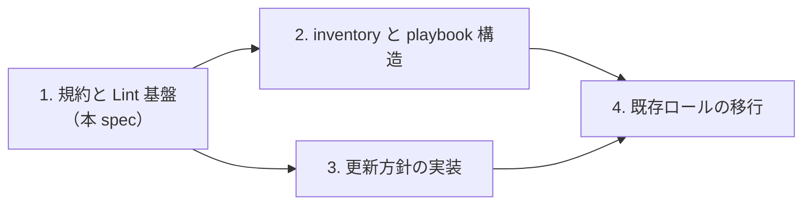

# Ansible 規約の刷新 設計

## 背景と目的

このリポジトリは長く運用されてきたため、命名、タグ、変数の置き場所、タスクの並び順、更新方針がロールごとにばらついている。AGENTS.md の現行規約には Red Hat CoP の Good Practices for Ansible（以下 CoP）や ansible-lint の推奨と食い違う点もある。`ansible-lint --profile production` を現状に流すと、`var-naming[no-role-prefix]` 46 件、`name[template]` 24 件、`no-changed-when` 2 件、`role-name` 1 件が出る。

目的は、現在のベストプラクティスに沿った規約を定め、それを機械的に検査できる状態にすることである。制約は次のとおり。

- 個人環境なので、堅牢さとシンプルさの釣り合いを取る
- プレイブックを流せば、パッケージがほぼ最新版になる
- 稼働中のホストに意図しない変更や再起動を起こさない

## 全体の分割

リファクター全体を 4 つのサブプロジェクトに分け、この順に spec、plan、実装を回す。本 spec はサブプロジェクト 1 を扱う。



| サブプロジェクト | 内容 |
|---|---|
| 1. 規約と Lint 基盤 | AGENTS.md の規約、ansible-lint、pre-commit、CI、Dependabot、見本ロール `filebrowser` の移行 |
| 2. inventory と playbook 構造 | `singleton_*` グループの扱い、inventory のディレクトリ化、`host_vars` の導入、README の構成図 |
| 3. 更新方針の実装 | cooldown 付き最新版解決を GitHub Release、git、HA カスタムコンポーネントへ広げる。`docker/quarantine` の改名と一般化 |
| 4. 既存ロールの移行 | 残りのロールを規約に合わせる。ロールごとの命名判断、大きいファイルの分割、詰め合わせロールからの格上げ |

HA の YAML（`roles/homeassistant/files/`）のリファクターはどのサブプロジェクトにも含めず、別セッションで扱う。

## 規約

以下を AGENTS.md の「Ansible Conventions」として書き直す。現行の「Roles and Tasks」「Tags」「Idempotency」は置き換える。

### 更新方針

| 対象 | ルール |
|---|---|
| OS のパッケージマネージャー（apt、brew）とその公式リポジトリ | cooldown なしで即最新にする。OS ロールの最後に一括更新する |
| サードパーティのコンテナイメージ、GitHub Release、git リポジトリ、HA のカスタムコンポーネント | 公開から `supply_chain_cooldown_days` 日以上たった最新リリースを実行時に解決して使う。git はブランチではなくリリースタグを対象にし、タグのないリポジトリは同じ日数たったコミットを使う |
| 自分のリポジトリ | cooldown なしでデフォルトブランチを追う |
| 例外的に固定するもの | `<role>_<component>_version` を置き、固定する理由をコメントに書く |

`supply_chain_cooldown_days` は `group_vars/all` に 4 として置く。バージョンは固定する例外を除き vars に書かない。

ansible-lint の `package-latest` と CoP 11.6 は `latest` やブランチ参照を避けるよう求めるが、どちらも検証環境から本番へ段階的に反映する組織を前提にしている。個人環境ではその段階がないため、実行時に最新を解決する方式を採る。公開直後のリリースを踏むリスクは cooldown で抑える。

### ロールの設計

CoP 2.2 の type、function、component の考え方に従う。playbook はホストの type ごとに 1 本、ロールは function、ロール内の `tasks/<component>.yml` は component にあたる。

OS ロール（`ubuntu`、`darwin`）とプラットフォームロール（`raspberrypi`、`ec2`）には、その OS やプラットフォームでしか意味を持たない設定だけを component として残す。例は timezone、ssh、sysctl、journald、swap、パッケージリストである。次のどれかに当てはまる component は独立したロールに格上げする。

1. 複数の OS や type で使う（例: 1password、uv、kiro、agent-browser、lightpanda）
2. 独自の設定、handler、バージョン管理を持つアプリやサービスである（例: fail2ban、backup、network-failover）
3. タスクファイル 1 本に収まらない

type ごとの違いはロールにせず、データか独立ロールで表す。`darwin/personal` と `darwin/business` は廃止し、パッケージの差分は `darwin_extra_packages` として inventory に置き、片方にしかないもの（nix、toolbox など）は独立ロールにして type の playbook で読み込む。

### OS やプラットフォームによる違い

| 違いの大きさ | 扱い | CoP |
|---|---|---|
| 値だけが違う（パッケージ名、パス、サービス名） | `vars/<distribution>.yml` を `tasks/set_vars.yml` で読み分ける | 4.1.6、4.1.11 |
| 手順が少し違う | `tasks/<variant>.yml` を読み分ける。切り替えのキーは fact か inventory の変数にし、グループ名は使わない | 4.1.12、4.1.13、4.1.18 |
| 実装がまったく別物 | ロールを分ける | 4.1.1 |

例として `zabbix/agent/{ubuntu,ec2,raspberrypi}` は 1 つの `zabbix_agent` ロールにまとめ、差分を `tasks/platform/{ec2,raspberrypi}.yml` に置き、`zabbix_agent_platform` で切り替える。

OS 名は Ansible の fact の値を小文字にしたものを使う。Linux は `distribution`（`ubuntu`）、macOS は `system`（`darwin`）を使う。`macos` とは呼ばない。ハードウェアやクラウドの名前（`raspberrypi`、`ec2`）は OS 名と区別し、プラットフォーム名として扱う。

### ロール名

- `^[a-z][a-z0-9_]*$` のフラットな snake_case にする。ディレクトリのネストとハイフンは使わない。階層は接頭辞で表す（例: `zabbix_server`、`postfix_client`、`database_client_gui`、`homeassistant_ha_primary`）
- 1 つの製品をインストールして設定するロールは製品名にする（例: `mosquitto`、`restic`、`zabbix_server`）
- 複数の製品を組み合わせて 1 つの目的を果たすロールは機能名にする（例: `nas`、`nvr`、`sslcert`、`desktop`）
- OS の基本設定は OS 名、プラットフォーム固有の上乗せはプラットフォーム名にする
- playbook のファイル名はハイフン区切りのままでよい（CoP 3.1）

CoP 4.1.1 は機能名を推すが、その狙いは複数の実装を 1 つの窓口の裏に隠すことにある。このリポジトリではどの機能も実装が 1 つなので、製品名を基本にする。

ネストをやめるのは、Ansible と ansible-lint がネストしたロールを末尾のディレクトリ名で扱うためである。`zabbix/server` は `server` として扱われ、`zabbix_` 接頭辞の変数が違反になる。

### タスク名

- 命令形で先頭を大文字にする。ロール名は付けない（Ansible が実行ログに自動で付ける）
- `tasks/main.yml` は `tasks/<component>.yml` を `import_tasks` で読み込む行だけにする
- component ファイル内のタスク名は `<component> | <Description>` にする（例: `container | Resolve aged image`）。ansible-lint の `name[prefix]` で検査する
- component 名は扱う対象を表し、ロール名を繰り返さない（例: `filebrowser` ロールの component は `config`、`container`）
- Jinja はタスク名の末尾にだけ置く
- handler 名も命令形にする（例: `Restart filebrowser`、`Reload Apache`）

実行ログは `TASK [ubuntu : fail2ban | Install package]` の形になる。

### タグ

使うタグは次の 3 種類に限る（CoP 6.3）。

| タグ | 付ける場所 | 用途 |
|---|---|---|
| ロール名 | playbook でロールを読み込む箇所 | ロール単位の実行と除外 |
| `<role>_<component>` | `tasks/main.yml` の `import_tasks` | component 単位の実行 |
| `update` | 更新を担う component の `import_tasks`、および OS ロールの `upgrade.yml` | 更新だけの実行 |

- component ファイルは単体で完結させる。前提のディレクトリ、リポジトリ、設定を同じファイルに含め、どのタグで単独実行しても意味のある結果になるようにする
- `update` は個々のタスクではなく component 全体に付ける。バージョン解決だけに付けると、解決した結果を反映するタスクが `--tags update` で動かない
- `always` は `set_vars.yml` と fact の設定だけに使う
- `init`、`install`、`config` などの操作タグは使わない

### 並び順

playbook の中のロールは、OS、プラットフォーム、複数 OS 共通のツール、サービスの層の順に並べ、同じ層の中はアルファベット順にする。順番が本当に必要な依存は `meta/main.yml` の `dependencies` に書く。

ロールの `tasks/main.yml` は次の順にする。

1. `set_vars.yml` と fact の設定（`always`）
2. 各 component。依存があれば依存順、なければアルファベット順
3. OS ロールでは最後に `upgrade.yml`（apt `upgrade: dist`、brew `upgrade_all`、`update` タグ）

component ファイルの中は次の順にする。

1. 前提の準備（apt リポジトリ、GPG キー、ディレクトリ）
2. バージョン解決
3. インストール
4. 設定
5. サービスの有効化と起動
6. 旧設定の削除（`state: absent`）

再起動は handler で行う。後続の component が再起動後の状態を必要とするときだけ `meta: flush_handlers` を挟む。旧設定の削除タスクは、全ホストに反映したあとで削除する。

### 変数

| 置き場所 | 置くもの |
|---|---|
| タスクに直接書く | 1 つのタスクでしか使わず、その場で意味が分かる値（`mode`、そのタスクだけが扱うパス） |
| `vars/main.yml` | どのホストでも同じ定数。2 箇所以上で使う値、リスト、URL、ポート、UID、Secret Reference |
| `vars/<distribution>.yml` | OS ごとに違う定数 |
| `defaults/main.yml` | inventory で変える可能性のある入力。意味のある既定値がないものはコメントアウトして載せる |
| inventory の `group_vars` / `host_vars` | ホストやグループごとのあるべき状態。ファイルはロールごとに分ける |
| `group_vars/all/` | サイト全体で意味の変わらない共有値 |

- ロール内で定義する変数にはロール名の接頭辞を付ける。`register` と `set_fact` で作る内部変数は `__<role>_` で始める
- `group_vars/all/` の共有値だけは接頭辞なしを認める。一覧を AGENTS.md に載せ、汎用すぎる名前は具体的にする（例: `local` → `local_network`）
- Secret Reference はホストによらず同じならロールの `vars/main.yml`、ホストで違うなら inventory に置く
- play vars、`include_vars`（`set_vars.yml` を除く）、あるべき状態を extra vars で渡すことは避ける（CoP 7.5、7.6）

### クォート

- YAML の文字列はダブルクォート、Jinja の式の中の文字列はシングルクォートにする（例: `"{{ x | default('a') }}"`）（CoP 9.2）
- キーワード、数値、真偽値、パスはクォートしない。`{` で始まる値や `: ` を含む値など、YAML の構文上必要なときだけクォートする
- `mode` はダブルクォートで囲んだ 4 桁の 8 進数（`"0644"`）にする
- バックスラッシュを含む文字列（正規表現など）はエスケープが不要なシングルクォートにする
- タスク名は `: ` を含むときだけクォートする

自動検査（yamllint の `quoted-strings`）は有効にせず、ロールの移行時に直す。`yaml` ルールの違反は行単位で ignore できず、ignore の管理が増えるためである。

### 品質

- check mode で失敗せず、変更がなければ変更を報告しない。2 回目の実行で `changed=0` になる（CoP 4.1.8、4.1.9、12.6）
- restart handler は管理対象の内容が変わったときだけ通知する
- check mode では何も変更しない。dry-run で前提が作られず後続タスクが実行できないときは、そのタスクをスキップして理由を表示する
- `command` と `shell` は専用モジュールがないときだけ使い、理由をコメントに書く。`changed_when` を必ず設定する
- パッケージは `item` でループせず、リストで一度に渡す
- `set_fact` は必要なときだけ使う。ファイル全体を管理するなら `template` を使い、`lineinfile` はシステムファイルの 1 行を直す用途に限る
- テンプレートの先頭に `{{ ansible_managed | comment }}` を入れる
- `backup: true` は使わない
- `debug` には `verbosity` を付ける

### 採用しない CoP の項目

| CoP | 理由 |
|---|---|
| 4.1.17 ロールごとの README | `defaults/main.yml` のコメントと AGENTS.md で足りる |
| 4.1.20 `argument_specs` | ロールを外部に提供しない |
| 12.3 Molecule | launchd、GPIO、NVMe などコンテナで再現しにくい対象が多い。check mode と 2 回目の実行で代える |
| 3.3 動詞-名詞の playbook 名 | type ごとの playbook 名（`ubuntu.yml`）のほうが 2.2 と整合する |
| 4.1.14 `backup: true` の常用 | 変更履歴は Git で追え、ホストにバックアップファイルがたまるだけになる。`backup: true` は使わず、既存の指定はロールの移行時に消す |
| 5、10、11、13.4 以降 | Collection、AAP、リリース管理、CD は使わない |

## Lint と CI

### ansible-lint

ansible-lint だけを使い、yamllint を単体で流す運用はやめる。ansible-lint の `yaml` ルールは内部で yamllint を呼び、`.yamllint` を設定として読むので、Ansible のコードについては単体の yamllint が二重チェックになる。

`.ansible-lint` は次のとおりにする。

```yaml
profile: production

enable_list:
  - name[prefix]

exclude_paths:
  - roles/homeassistant/files/
```

`skip_list` は空にする。`role-name[path]` はロールのフラット化で、`name[play]` は play に名前を付けることで不要になる。`name[casing]` はタスク名の先頭を大文字にする規約そのものなので検査対象に戻す。既存の違反は `.ansible-lint-ignore` に入る。`.yamllint` は現状のまま残す。

現状の違反は `ansible-lint --generate-ignore` で `.ansible-lint-ignore` に記録し、CI が最初から通る状態で始める。ロールを移行するたびに、そのロールの行を消す。新しいコードは ignore の対象にならない。

### pre-commit

`.pre-commit-config.yaml` を追加し、ansible-lint の公式フック（`https://github.com/ansible/ansible-lint`）を `rev: v26.8.0` で使う。

ansible-lint はルールの追加や変更を伴って更新されるため、`rev` はタグに固定し、手元と CI で同じバージョンを使う。最新への追従は Dependabot の PR で行う。

### GitHub Actions

`.github/workflows/ansible-lint.yml` を追加する。

- トリガーは `push` と `pull_request`
- `permissions` は `contents: read` だけ
- `actions/checkout` と `astral-sh/setup-uv` をコミット SHA で固定し、バージョンをコメントに書く
- `uvx pre-commit run --all-files` を実行し、pre-commit と同じチェックを回す

### Dependabot

`.github/dependabot.yml` を追加し、`pre-commit` と `github-actions` のエコシステムを対象にする。`cooldown` は `default-days: 4` とし、実行時の cooldown と日数を揃える。更新 PR で lint が落ちたときはその PR で直してからマージする。

## 見本ロール: `filebrowser`

規約を実際のコードに当てて穴を見つけ、サブプロジェクト 4 の手本にするため、`filebrowser` を移行する。compose、`docker/quarantine` による cooldown、vars、templates、handlers、複数の component がそろっていて、1 ロールで規約の大半を試せる。

### 構成

```
roles/filebrowser/tasks/
  main.yml        # 以下を import_tasks で読み込むだけ
  config.yml      # マウントの確認、データディレクトリ、config.yaml
  container.yml   # イメージの解決、compose へのブロック追加、起動
  apache.yml      # vhost、a2ensite
  fail2ban.yml    # filter、jail
```

`config` のデータディレクトリがないと `container` が起動できないため `config`、`container` の順にする。`apache` と `fail2ban` は互いに依存しないのでアルファベット順にする。

`tasks/main.yml` のタグは次のとおり。

| component | タグ |
|---|---|
| `config.yml` | `filebrowser_config` |
| `container.yml` | `filebrowser_container`、`update` |
| `apache.yml` | `filebrowser_apache` |
| `fail2ban.yml` | `filebrowser_fail2ban` |

ロール名のタグ `filebrowser` は playbook 側で付ける。

### 変更点

- タスク名を `<component> | <Description>` の形にする
- handler 名を `Restart filebrowser`、`Reload Apache`、`Restart fail2ban` にし、`notify` を合わせる
- `register: filebrowser_a2ensite` を `__filebrowser_a2ensite` にし、`a2ensite` を `command` で呼ぶ理由（専用モジュールがない）をコメントに書く
- テンプレートの先頭を `{{ ansible_managed | comment }}` に揃える。compose のブロックは `blockinfile` の marker が管理を示すので対象外とする
- `singleton_int1.yml` で `filebrowser` ロールにタグ `filebrowser` を付ける
- `docker/quarantine` の呼び出しは残す。改名と一般化はサブプロジェクト 3 で行う
- `config.yaml` のテンプレートタスクから `backup: true` を消す。既存のコメントは残す

### 検証

1. `.ansible-lint-ignore` を使わずに `ansible-lint roles/filebrowser` を流し、違反 0 件にする
2. `ansible-playbook singleton_int1.yml --limit fox.rewse.jp --tags filebrowser --check --diff` を流し、差分がテンプレートのヘッダーだけであることを確かめる
3. ユーザーの確認を取ってから同じコマンドを `--check` なしで流す。ヘッダーの変更で Apache の reload、fail2ban と filebrowser の再起動が 1 回ずつ起きる見込みである
4. もう一度流し、`changed=0` を確かめる

プレイブックの成否は PLAY RECAP ではなくプロセスの終了コードで判断する。

## 完了条件

- 手元で `pre-commit run --all-files` が通る
- GitHub Actions の lint ワークフローが成功する
- `.ansible-lint-ignore` に `roles/filebrowser` の行がない
- `filebrowser` の 2 回目の実行で `changed=0` になる
- AGENTS.md の規約と `filebrowser` の実装だけを見て、ほかのロールを同じ形に移行できる

## 範囲外

- inventory の再編と `singleton_*` の扱い（サブプロジェクト 2）
- cooldown の仕組みを全体に広げる作業（サブプロジェクト 3）
- `filebrowser` 以外のロールの移行（サブプロジェクト 4）
- HA の YAML のリファクターと lint（別セッション）
