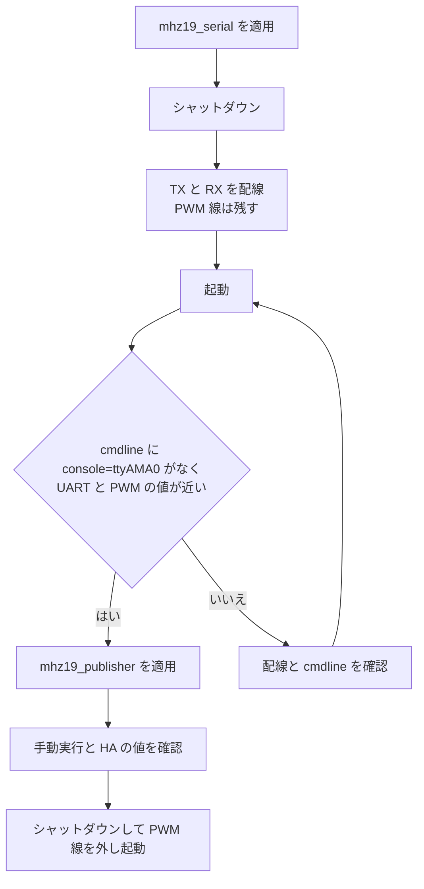

# MH-Z19 の UART 読み取りへの切り替え 設計

## 背景と目的

fox（Living Room）と hotel（Dad's Room）の MH-Z19 は、`mhz192mqtt` が `python3 -m mh_z19 --pwm` で GPIO12 の PWM 出力を読んでいる。PWM の読み取りは、ライブラリがエッジを待ったあとに `time.time()` でパルス幅を測るため、Python の起床が遅れると値がずれる。エッジの取り逃しで読み取りがタイムアウトすることもあり、`read_co2` のリトライはこれに対応している。

2026-09 から Living Room で数千 ppm の異常値が続いた。カーネルのタイムスタンプで同じ PWM 信号を測っても値が動いていたので、主な原因はセンサー自体と判断し、`filter_co2` で異常値を捨てるようにした（`b50f15da`）。

目的は、読み取り経路の誤差をなくし、壊れたフレームをチェックサムで捨てられるようにすることである。UART なら ABC やゼロ点校正のコマンドも使えるようになる。センサーが正しいチェックサム付きで誤った値を返す場合は UART でも防げないため、`filter_co2` は残す。

## 範囲

対象は fox と hotel の 2 台で、どちらも PWM から UART に切り替え、PWM の配線とコードを取り除く。

範囲外は次のとおり。

- ABC、ゼロ点校正、検出レンジの変更。今のセンサー設定のまま使う
- fox の `config.txt` にある `dtoverlay=disable-bt`。Ansible の管理外のまま触らない
- Frigate のメモリ増加。別に設計する

## 現状

| 項目 | fox | hotel |
|---|---|---|
| モデル | Raspberry Pi 5 | Raspberry Pi 5 |
| `enable_uart=1` | あり | あり |
| `/dev/ttyAMA0`（GPIO14/15 の UART0） | あり | あり |
| `/proc/cmdline` の `console=ttyAMA0,115200` | あり | あり |
| `/dev/serial0` | なし | なし |
| Bluetooth | USB ドングル（オンボードは `disable-bt` で無効） | オンボード（専用の UART を使い、GPIO の UART0 とは別） |

Bluetooth は両ホストとも GPIO14/15 を使わないので、UART0 と競合しない。

`mh_z19` は Pi 5 で `/dev/ttyAMA0` を既定にする。ただし `--serial_console_untouched` を付けないと、読むたびに `sudo systemctl stop` と `start` で `serial-getty@ttyAMA0` を止めて戻す。

## 設計

### シリアルコンソールの停止

mhz19 ロールに `tasks/serial.yml` を足し、`tasks/main.yml` からタグ `mhz19_serial` で import する。UART0 を必要とするのは mhz19 だけなので、raspberrypi ロールではなく mhz19 ロールに置く。こうすると、mhz19 を入れないホストではコンソールが残る。

`serial.yml` は次の順に処理する。

1. `/boot/firmware/config.txt` に `enable_uart=1` があることを `lineinfile` で保証する
2. `/boot/firmware/cmdline.txt` から `console=ttyAMA0,115200` を取り除く。`roles/raspberrypi/tasks/nvme.yml` と同じく `lineinfile` の `backrefs` を使い、パラメーターがない行には何もしない。vfat はコロンを含むファイル名を受け付けないので、`backup` は使えない
3. `serial-getty@ttyAMA0.service` を mask する。コンソール指定がなくなれば systemd-getty-generator はこの getty を作らないが、手動で有効にされた場合にも UART を奪われないようにする

1 の `lineinfile` は、行がないときにファイル末尾へ足す。末尾が `[all]` 以外のセクションだとそのモデルにしか効かないため、`insertafter` で `[all]` の直後に足す。両ホストとも今は行があるので、変更は起きない。

再起動は Ansible では行わず、手動で計画して行う。`cmdline.txt` の変更は再起動するまで効かないため、`serial.yml` は変更があったときに `verbosity: 0` の `debug` で再起動が必要だと知らせる。

### 読み取り

`templates/mhz192mqtt.j2` の `read_co2` で、`python3 -m mh_z19 --pwm` を `python3 -m mh_z19 --serial_device /dev/ttyAMA0 --serial_console_untouched` に置き換える。デバイスはライブラリの機種判定に頼らず明示する。

UART の読み取りは、チェックサムの不一致や無応答のときに `{}` を返す。この場合は今と同じく `grep` が値を取り出せずに失敗するので、3 回のリトライ、オフライン通知、`OnFailure` の流れをそのまま使える。PWM のエッジ取り逃しについて書いたリトライのコメントは、UART の失敗要因（無応答とチェックサム不一致）に合わせて書き直す。

`filter_co2` と `MAX_CO2=4900` は変えない。センサーの検出レンジは今の 5000 ppm のままだからである。PWM と UART で同じ時点の値に差が出ても、`MAX_STEP` の 200 ppm 以内なら切り替え直後の値も採用される。超えた場合も、3 回の値がそろえば採用し直す。

### 配線

| MH-Z19 | Raspberry Pi 5 |
|---|---|
| TX | GPIO15（RXD、ピン 10） |
| RX | GPIO14（TXD、ピン 8） |
| Vin、GND | 今の配線のまま |
| PWM | 切り替えの確認が済むまで GPIO12 に残し、最後に外す |

MH-Z19 の UART は 3.3V レベルなので、レベル変換なしで GPIO に直結する。配線は電源を切ってから行う。

### 切り替え手順

hotel で手順を確かめてから fox に進む。ホストごとに次の順で行う。

PWM 線を外すまでは、どちらの読み取りでも戻せる。publisher の適用前に問題があれば、配線を戻さなくても今の PWM の読み取りが動き続ける。

### 切り戻し

publisher の変更を revert して `mhz19_publisher` を適用すれば PWM に戻る（PWM 線を外す前に限る）。シリアルコンソールは PWM の読み取りと競合しないので、`cmdline.txt` は戻さなくてよい。

## 検証

- `--check --diff` で、`mhz19_serial` と `mhz19_publisher` の差分が意図どおりであること
- 適用後の 2 回目が `changed=0` であること
- 再起動後の `/proc/cmdline` に `console=ttyAMA0` がなく、`serial-getty@ttyAMA0` が masked であること
- `python3 -m mh_z19 --serial_device /dev/ttyAMA0 --serial_console_untouched` と `--pwm` を交互に数回実行し、正常時の値の差が数十 ppm 以内であること
- `systemctl start mhz192mqtt` が成功し、HA の `sensor.living_room_co2` と `sensor.dads_room_co2` が更新されること
- 切り替えから 1 日後に、journal の `rejected` の件数とセンサーの失敗通知を確認すること
- pre-commit と `tests` が通ること
